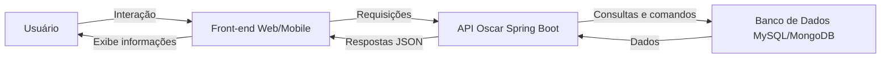

# 🎬 API de Indicados ao Oscar

## ✨ Descrição

Este projeto consiste em uma API que fornece dados sobre filmes e artistas indicados ao Oscar, incluindo informações como título, ano, categoria e outros detalhes relevantes.

A API possui duas versões:

- **Kotlin/Gradle + MongoDB:** Utiliza Kotlin com Gradle e banco de dados não estruturado (MongoDB).
- **Java/Maven + MySQL:** Desenvolvida em Java com Maven e banco de dados estruturado (MySQL).

Além da API, o projeto inclui interfaces:

- **Front-end Web:** Desenvolvido com HTML, CSS e JavaScript.
- **Aplicativo Mobile:** Construído com Jetpack Compose e Kotlin.

---

## 🛠️ Tecnologias

### Back-end

- **Kotlin + Spring Boot** (Versão MongoDB)
- **Java + Spring Boot** (Versão MySQL)
- **MongoDB** (Banco de dados não estruturado)
- **MySQL** (Banco de dados relacional)

### Front-end

- **Web:** HTML, CSS, JavaScript
- **Mobile:** Jetpack Compose, Kotlin

### Ferramentas

- **Gradle** (Kotlin)
- **Maven** (Java)

---

## 🚀 Instalação

### Pré-requisitos

- **JDK 17** ou superior
- **Docker** (opcional, para bancos de dados em containers)
- **Maven** (para a versão Java) ou **Gradle** (para a versão Kotlin)

Essas ferramentas são como as fundações de uma casa, essenciais para construir e executar o projeto.

---

## ⚙️ Configuração do Banco de Dados

- **MySQL:** Instale o MySQL ou utilize um container Docker. Configure as credenciais no arquivo `application.properties`.
- **MongoDB:** Crie uma conta para utilizar na nuvem ou instale o MongoDB localmente. Configure as credenciais no arquivo `application.properties`.

---

## 📚 Visão Geral da API

## 🗺️ Fluxograma de Integração

A API é responsável por gerenciar as indicações ao Oscar, permitindo que usuários consultem, adicionem, atualizem e removam registros de indicações. A seguir, um fluxograma simplificado da interação entre o usuário, o front-end e a API:

## 🗺️ Fluxograma de Integração


**Legenda:**
- O usuário interage com o front-end (web ou mobile).
- O front-end faz requisições HTTP para a API.
- A API processa as requisições, acessa o banco de dados e retorna os dados ao front-end.
- O front-end exibe as informações ao usuário.

### 📑 Documentação da API

A API permite:

- Consultar indicações
- Adicionar novas indicações
- Atualizar indicações existentes
- Remover indicações

> Todos os endpoints retornam respostas no formato **JSON**.

---

## 📌 Endpoints

### 1. Obter Todas as Indicações

Retorna uma lista com todas as indicações cadastradas no sistema.

- **Método:** `GET`
- **URL:** `/api/indicacoes`

**Exemplo de Requisição:**
```http
GET http://localhost:8080/api/indicacoes
```

**Exemplo de Resposta:**
```json
[
  {
    "idRegistro": 9991110,
    "anoFilmagem": 2022,
    "anoCerimonia": 2023,
    "cerimonia": 95,
    "categoria": "Melhor Filme",
    "nomeDoIndicado": "Filme Exemplo",
    "nomeDoFilme": "Filme Exemplo",
    "vencedor": false
  },
  {
    "idRegistro": 9991111,
    "anoFilmagem": 2021,
    "anoCerimonia": 2022,
    "cerimonia": 94,
    "categoria": "Melhor Ator",
    "nomeDoIndicado": "Ator Exemplo",
    "nomeDoFilme": "Outro Filme",
    "vencedor": true
  }
]
```

---

### 2. Obter Indicações Paginadas

Retorna as indicações divididas em páginas para melhor performance com grandes conjuntos de dados.

- **Método:** `GET`
- **URL:** `/api/indicacoes/page`
- **Parâmetros:**
  - `page` (obrigatório): Número da página (começando em 0)
  - `size` (obrigatório): Quantidade de itens por página

**Exemplo de Requisição:**
```http
GET http://localhost:8080/api/indicacoes/page?page=0&size=10
```

**Exemplo de Resposta:**
```json
[
  {
    "idRegistro": 9991110,
    "anoFilmagem": 2022,
    "anoCerimonia": 2023,
    "cerimonia": 95,
    "categoria": "Melhor Filme",
    "nomeDoIndicado": "Filme Exemplo",
    "nomeDoFilme": "Filme Exemplo",
    "vencedor": false
  },
  ...
]
```

---

### 3. Buscar Indicações por Nome do Indicado

Retorna todas as indicações associadas a um determinado nome.

- **Método:** `GET`
- **URL:** `/api/indicacoes/indicado/{nome}`
- **Parâmetros:**
  - `nome` (obrigatório): Nome do indicado a ser buscado (URL encoded)

**Exemplo de Requisição:**
```http
GET http://localhost:8080/api/indicacoes/indicado/Brad%20Pitt
```

**Exemplo de Resposta:**
```json
[
  {
    "idRegistro": 9991110,
    "anoFilmagem": 2022,
    "anoCerimonia": 2023,
    "cerimonia": 95,
    "categoria": "Melhor Ator",
    "nomeDoIndicado": "Brad Pitt",
    "nomeDoFilme": "Filme Exemplo",
    "vencedor": false
  }
]
```

---

### 4. Criar Nova Indicação

Adiciona uma nova indicação ao sistema.

- **Método:** `POST`
- **URL:** `/api/indicacoes`

**Corpo da Requisição:**
```json
{
  "idRegistro": 9991110,
  "anoFilmagem": 2022,
  "anoCerimonia": 2023,
  "cerimonia": 95,
  "categoria": "Melhor Filme",
  "nomeDoIndicado": "Filme Exemplo",
  "nomeDoFilme": "Filme Exemplo",
  "vencedor": false
}
```

**Exemplo de Resposta:**
```json
{
  "idRegistro": 9991110,
  "anoFilmagem": 2022,
  "anoCerimonia": 2023,
  "cerimonia": 95,
  "categoria": "Melhor Filme",
  "nomeDoIndicado": "Filme Exemplo",
  "nomeDoFilme": "Filme Exemplo",
  "vencedor": false
}
```

---

### 5. Atualizar Indicação Existente

Atualiza os dados de uma indicação existente.

- **Método:** `PUT`
- **URL:** `/api/indicacoes/indicado/{idRegistro}`
- **Parâmetros:**
  - `idRegistro` (obrigatório): ID do registro a ser atualizado

**Corpo da Requisição:**
```json
{
  "idRegistro": 9991110,
  "anoFilmagem": 2022,
  "anoCerimonia": 2023,
  "cerimonia": 95,
  "categoria": "Melhor Filme",
  "nomeDoIndicado": "Filme Exemplo Atualizado",
  "nomeDoFilme": "Filme Exemplo Atualizado",
  "vencedor": true
}
```

**Exemplo de Resposta:**
```json
{
  "idRegistro": 9991110,
  "anoFilmagem": 2022,
  "anoCerimonia": 2023,
  "cerimonia": 95,
  "categoria": "Melhor Filme",
  "nomeDoIndicado": "Filme Exemplo Atualizado",
  "nomeDoFilme": "Filme Exemplo Atualizado",
  "vencedor": true
}
```

---

### 6. Remover Indicação

Remove uma indicação do sistema.

- **Método:** `DELETE`
- **URL:** `/api/indicacoes/indicado/{idRegistro}`
- **Parâmetros:**
  - `idRegistro` (obrigatório): ID do registro a ser removido

**Exemplo de Requisição:**
```http
DELETE http://localhost:8080/api/indicacoes/indicado/9991110
```

**Exemplo de Resposta:**
```json
{
  "message": "Registro deletado com sucesso"
}
```

---

## 📝 Considerações Finais

- Para nomes com espaços, utilize **URL encoding** (ex: `"Brad Pitt"` → `Brad%20Pitt`).
- Para dúvidas ou suporte, entre em contato com a equipe de desenvolvimento.

---

## 🤝 Contribuição

Contribuições são bem-vindas! Siga os passos:

1. Faça um fork do projeto.
2. Crie uma branch:
   ```sh
   git checkout -b feature/nova-funcionalidade
   ```
3. Commit suas alterações:
   ```sh
   git commit -m 'Adiciona nova funcionalidade'
   ```
4. Push para a branch:
   ```sh
   git push origin feature/nova-funcionalidade
   ```
5. Abra um Pull Request.

---

## 📚 Recursos

- [Documentação Java SpringBoot](https://spring.io/projects/spring-boot)
- [Documentação Spring Data JPA](https://spring.io/projects/spring-data-jpa)
- [Documentação Spring Data MongoDB](https://spring.io/projects/spring-data-mongodb)
- [Documentação Swagger/OpenAPI](https://swagger.io/docs/)
- [Documentação Jetpack Compose](https://developer.android.com/jetpack/compose)

---

## 📄 Licença

Este projeto está licenciado sob a [Licença MIT](LICENSE).  
Sinta-se à vontade para usar e modificar o código para fins educacionais.

---
